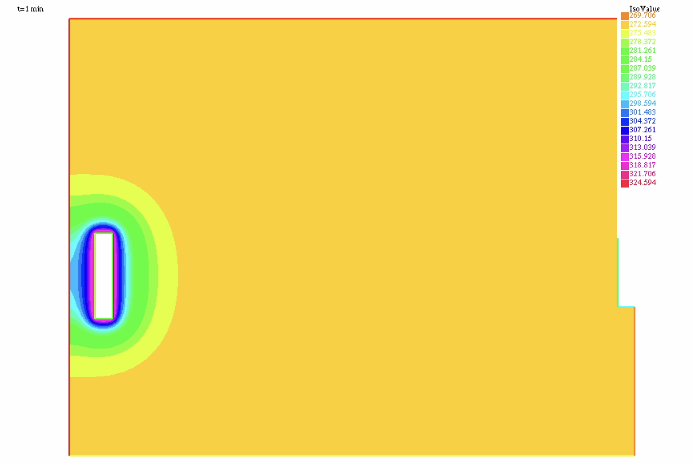
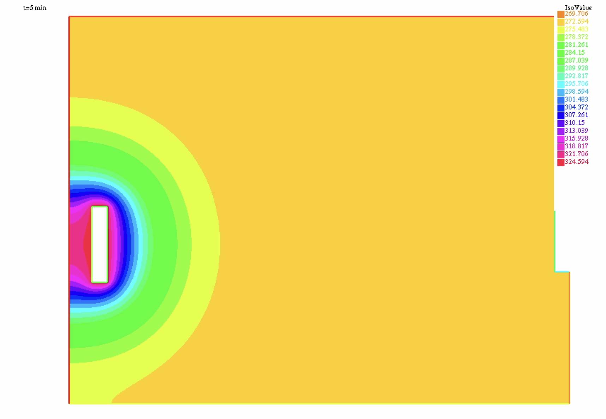
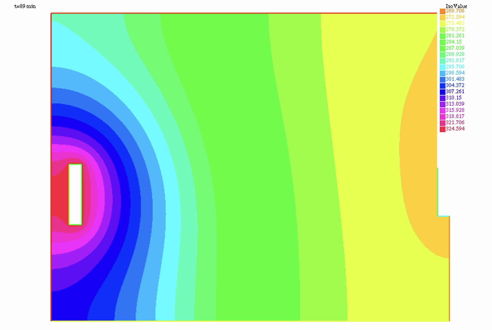
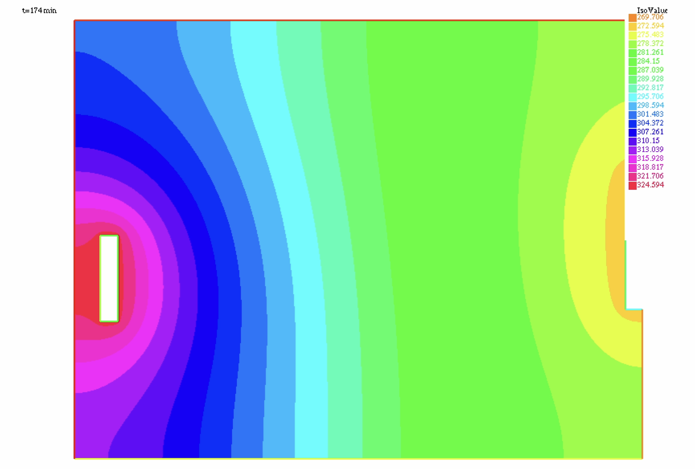
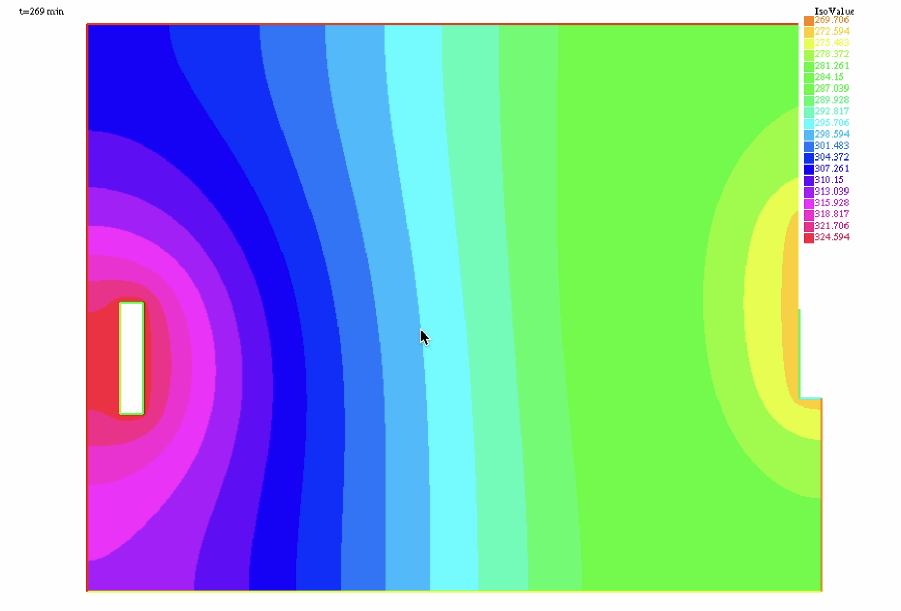
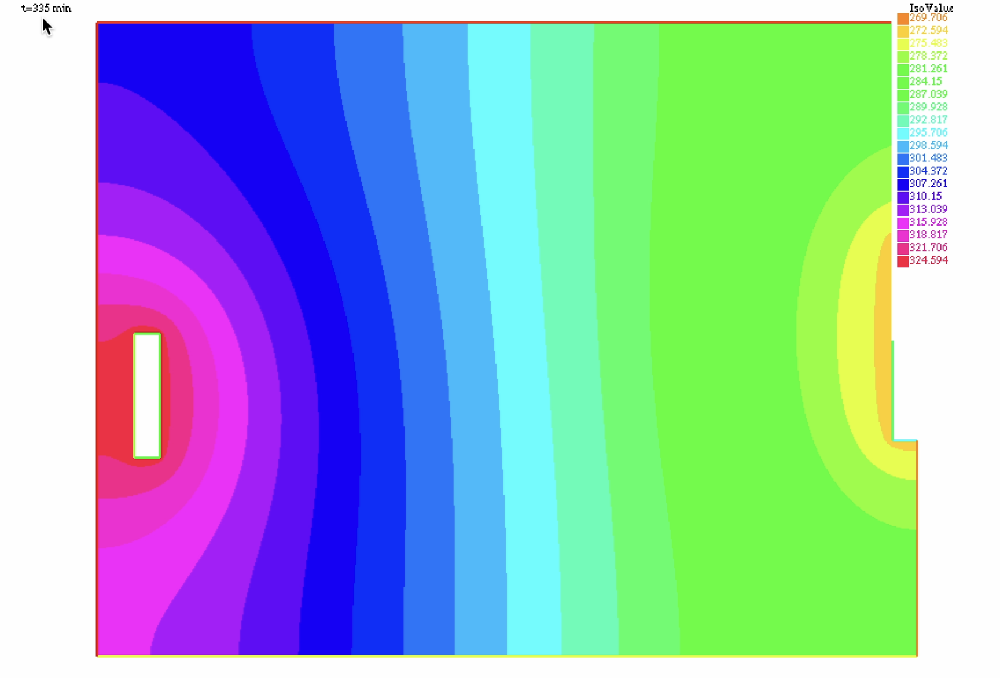

# Méthode des Elements Finis - TP Équation de chaleur

**Authors:** Tanguy Renaudie, Philippe Chaumet-Riffaud  
**Date:** December 2024

## Introduction

Le problème d'équation de chaleur proposé consiste à déterminer la distribution de chaleur $T$ d'une pièce, compte tenu des "sources" dans la pièce, notamment un radiateur, des murs et une fenêtre ouverte.

On donnera une approximation par calcul numérique de la solution stationnaire pour le champ de température $T$, pour trois ensembles de conditions initiales différentes.

Ensuite nous déterminerons la solution transitoire pour le champ de température $T$ par calcul numérique.

Nous utiliserons pour ceci le cours sur la méthode des éléments finis, et donc une formulation variationnelle du problème, ainsi que le logiciel de calcul numérique FreeFEM++.

## Problème Stationnaire

## La Pièce

Nous étudions un espace de vie rectangulaire, en deux dimensions, de largeur de 2,5m environ et de longueur 3,3m environ. On place un radiateur dans la pièce, d'un côté, et on considère qu'une fenêtre est ouverte de l'autre côté. On étudie alors le champ de température qui s'établit dans la pièce.

La pièce étudiée a les dimensions suivantes:

* Largeur: $l$
* Longueur: $L$
* Distance du radiateur au mur gauche: $d_{\text{rad}_l}$
* Distance du radiateur au sol: $d_{\text{rad}_b}$
* Épaisseur du radiateur: $e_{\text{rad}}$
* Longueur du radiateur: $L_{\text{rad}}$
* Distance de la fenêtre au mur du bas (mur d): $d_f$
* Épaisseur de la fenêtre: $e_f$
* Longueur de la fenêtre: $L_f$

Voici l'espace créé, et convertit en maillage, dans FreeFEM++.

On introduira les définitions des bords du maillage ci-dessous.


L'espace de la pièce se trouve à gauche, dans le sens du chemin choisi ci-dessous.
On considère que la fenètre est centrée sur le mur de droite. Donc elle se trouve à une même distance $d_f$ du mur du bas et du mur du haut


## Bords du mur 

Voici les définitions pour les segments qui constituent le mur extérieur. Notons en particulier que le mur de droite est constitué de deux segments séparés d'une fenêtre.

$$a = \{ {(x,y) \in \mathbb{R}^2 : x = 0, y \in [0,l]} \}$$

$$b = \left\{ {(x,y) \in \mathbb{R}^2 : x \in [0,L], y = l} \right\}$$

$$c_1 = \left\{(x,y) \in \mathbb{R}^2 : x = L , y \in [2d_f + L_f, d_f + L_f]\right\}$$

$$c_2 = \left\{(x,y) \in \mathbb{R}^2 : x = {L}, y \in [{d_f}, 0]\right\}$$

$$d = \left\{(x,y) \in \mathbb{R}^2 : x \in [0,\text{l}], y = 0\right\}$$

## Bords du radiateur

Nous considérons que le radiateur se trouve dans la salle, non collé à un mur. Il est placé sur le côté opposé de celui de la fenêtre.

$$a_{rad} = \left\{(x,y) \in \mathbb{R}^2 : x = d_{rad_l}, y \in [d_{rad_b}, d_{rad_b} + L_{rad}]\right\}$$

$$b_{rad} = \left\{(x,y) \in \mathbb{R}^2 : x \in [d_{rad_l}, d_{rad_l}+e_{rad}], y = d_{rad_b}+L_{rad}\right\}$$

$$c_{rad} = \left\{(x,y) \in \mathbb{R}^2 : x = d_{rad_l} + e_{rad}, y \in [d_{rad_b}, d_{rad_b} + L_{rad}]\right\}$$

$$d_{rad} = \left\{(x,y) \in \mathbb{R}^2 : x \in [d_{rad_l} + e_{rad}, d_{rad_l}], y = d_{rad_b}\right\}$$

## Bords de la fenêtre

$$a_{wind} = \left\{(x,y) \in \mathbb{R}^2 : x = L - e_f, y \in [d_f, d_f + L_f]\right\}$$

$$b_{wind} = \left\{(x,y) \in \mathbb{R}^2 : x \in [L - e_f, L], y = d_f + L_f\right\}$$

$$d_{wind} = \left\{(x,y) \in \mathbb{R}^2 : x \in [L, L - e_f], y = d_f\right\}$$


## Formulation de l'équation de chaleur

Le problème stationnaire est le suivant :

$$k \Delta T = 0$$

Notons $\Omega$ la pièce et $\Gamma$ les bords de la pièce. On a $\Gamma = \Gamma_1 \cup \Gamma_2 \cup \Gamma_3$ où :

* $\Gamma_1$ représente les murs de la pièce
* $\Gamma_2$ désigne les bords du radiateur
* $\Gamma_3$ désigne les bords de la fenêtre

D'où :

$$\int_\Omega v k \Delta T = 0$$

D'après la formulation de Green pour le champ de température $T$, qui est $C^1$ :

$$\int_\Omega v \Delta T = \int_\Omega \nabla v \cdot \nabla T \, dx + \int_\Gamma v(x) \partial_n T \, dx$$

On obtient l'équation finale suivante :

$$\int_\Omega k \nabla v \cdot \nabla T \, dx + \int_\Gamma k v(x) \partial_n T \, dx = 0$$


## Cas 1 : Flux de chaleur au mur

On considère les conditions suivantes au bord:
- Bord de la fenêtre : Température imposée T = -2°C
- Mur : Flux de chaleur imposée Φ = k∇T·n = −0.31W/m³
- Radiateur : Température imposée T = 50°C

On a donc l'équation :

$$ \int_\Omega k \nabla v \cdot \nabla T dx + \int_\Gamma v(x) \Phi dx = 0 $$

On intègre avec le solveur Conjugate Gradient de FreeFem :

```cpp
solve Laplace(u, v) = 
    int2d(Th)(    // The bilinear part
        dx(u)*dx(v) + dy(u)*dy(v)
    )
    + int1d(Th,c1,c2,a,b,d)( flux / kheat * v )
    //+ int1d(Th, c2)( 0.31 / kheat * v )
    + on(arad, u=tempradiator)
    + on(brad, u=tempradiator)
    + on(crad, u=tempradiator)
    + on(drad, u=tempradiator)
    + on(awind, u=tempwindow)
    + on(bwind, u=tempwindow)
    + on(dwind, u=tempwindow);
```

Resultats :

Avec un flux de chaleur nulle au niveau du mur ( $\Phi = 0$), on obtient le champ stationnaire suivant 


Avec un flux de chaleur non nul au niveau du mur ( $\Phi = 0.31 W/m$), on obtient le champ stationnaire suivant 


## Cas 2 : Condition de Fourier au niveau du radiateur

Les conditions aux bords sont alors :

- Bord de la fenêtre : Température imposée T = -2°C
- Mur : Température imposée T = -2°C
- Radiateur : Condition de Fourier k∇T·n + h(T - Tf) = 0, avec h = 1W/(m°C) et Tf = 50°C

L'équation devient :

$$ \int_\Omega k \nabla v \cdot \nabla T dx + \int_\Gamma v(x) \frac{h}{k} (T - T_f) dx = 0 $$

On introduit le terme bilinéaire dans le solveur :

```cpp
solve Laplace(u, v) = 
    int2d(Th)(    // The bilinear part
        dx(u)*dx(v) + dy(u)*dy(v)
    )
    + int1d(Th,arad,brad,crad,drad)( v * hfourier / kheat * u)
    - int1d(Th,arad,brad,crad,drad)( v * hfourier / kheat * tempradiator )
    + on(awind, u=tempwindow)
    + on(bwind, u=tempwindow)
    + on(dwind, u=tempwindow)
    + on(a, u=tempwindow)
    + on(b, u=tempwindow)
    + on(c1, u=tempwindow)
    + on(c2, u=tempwindow)
    + on(d, u=tempwindow);
```

Résultats :


## Cas 3 : Condition de Fourier au niveau du mur

Les conditions aux bords sont alors :

- Bord de la fenêtre : Température imposée T = -2°C
- Mur : Condition de Fourier k∇T·n + h(T - Tf) = 0, avec h = 1W/(m°C) et Tf = -2°C
- Radiateur : Température imposée T = 50°C

Résultats :


# Problème Transitoire

On étudie dorénavant le régime transitoire, lorsque le radiateur est allumé. 
On considère que la pièce est d'une température initiale uniforme à $T_0 = -2°C$

## Formulation variationnelle du problème 

L'équation du régime transitoire est la suivante :

$$ \rho C_p \frac{\partial T}{\partial t} + k \Delta T = 0 $$

On choisit de résoudre cette équation avec la Méthode Euler Implicite, qui est plus rapide que la méthode Euler explicite.

On discrétise donc les opérateurs par rapport au temps :

$$ \frac{T_{n+1} - T_n}{\Delta t} \approx \frac{\partial T}{\partial t} $$
$$ \Delta T_{n+1} \approx \Delta T $$

On réécrit alors l'équation d'inconnue $T_{n+1} = T(t_{n+1})$ :

$$ \rho C_p \frac{T_{n+1} - T_n}{\Delta t} + k \Delta T_{n+1} = 0 $$

On passe a une formulation variationnelle du probleme:

$$ \int_\Omega \left(\rho C_p \frac{T_{n+1} - T_n}{\Delta t} + k \Delta T_{n+1}\right) v dx = 0 $$
$$ \int_{\Omega} \frac{\rho C_p}{\Delta t} T_{n+1} v dx + k \int_{\Omega} \nabla T_{n+1} \cdot \nabla v dx = \int_{\Omega} \frac{\rho C_p}{\Delta t} T_n v dx$$

On peut obtenir donc la valeur du champ $T_{n+1}$ a partir du champ $T_n$ a chaque instant. 
On pose $T_0 = -2 + 273.15 K$
Nous choisissons un pas de discrétisation $\Delta t = 60$ s.
On observe une phase stationnaire au bout de 300 minutes environ, soit 5 heures.
Voici le champ de température sur 8 instants différents, du début à la fin de la phase stationnaire.









