Je vais reformater ce document en Markdown tout en préservant sa structure et son contenu mathématique.

# Équation de chaleur

## Introduction

Le problème d'équation de chaleur proposé consiste à déterminer la distribution de chaleur d'une pièce, compte tenu des sources de chaleur et de froid présentes dans la pièce, notamment un radiateur, des murs et une fenêtre ouverte.

On donnera une approximation par calcul numérique de la solution stationnaire pour le champ de température T, pour trois ensembles de conditions initiales différentes.

Ensuite nous déterminerons la solution transitoire pour le champ de température T par calcul numérique.

Nous utiliserons pour ceci le cours sur la méthode des éléments finis, et donc une formulation variationnelle du problème, ainsi que le logiciel de calcul numérique FreeFEM++.

# Problème Stationnaire

Voici le texte avec les accents corrigés :

### La Pièce
Nous étudions un espace de vie rectangulaire, en deux dimensions, de largeur de 2,5m environ et de longueur 3,3m environ. On place un radiateur dans la pièce, d'un côté, et on considère qu'une fenêtre est ouverte de l'autre côté. On étudie alors le champ de température qui s'établit dans la pièce. 

Voici les bords. L'espace de la pièce se trouve à gauche, dans le sens du chemin choisi ci-dessous.

**Bords du mur** 
$$a = \{(x,y) \in \mathbb{R}^2 : x = 0, y \in [0,\text{width}]\}$$
$$b = \{(x,y) \in \mathbb{R}^2 : x \in [0,\text{length}], y = \text{width}\}$$
$$c_1 = \{(x,y) \in \mathbb{R}^2 : x = \text{length}, y \in [0,\text{depthwindow}]\}$$
$$c_2 = \{(x,y) \in \mathbb{R}^2 : x = \text{length}, y \in [\text{depthwindow} + \text{windowlength}, \text{width}]\}$$
$$d = \{(x,y) \in \mathbb{R}^2 : x \in [0,\text{length}], y = 0\}$$

**Bords du radiateur** 
$$a_{\text{rad}} = \{(x,y) \in \mathbb{R}^2 : x = \text{depthleft}, y \in [\text{depthbottom}, \text{depthbottom} + \text{lengthradiator}]\}$$
$$b_{\text{rad}} = \{(x,y) \in \mathbb{R}^2 : x \in [\text{depthleft}, \text{depthleft} + \text{widthradiator}], y = \text{depthbottom} + \text{lengthradiator}\}$$
$$c_{\text{rad}} = \{(x,y) \in \mathbb{R}^2 : x = \text{depthleft} + \text{widthradiator}, y \in [\text{depthbottom}, \text{depthbottom} + \text{lengthradiator}]\}$$
$$d_{\text{rad}} = \{(x,y) \in \mathbb{R}^2 : x \in [\text{depthleft} + \text{widthradiator}, \text{depthleft}], y = \text{depthbottom}\}$$

**Bords de la fenêtre** 
$$a_{\text{wind}} = \{(x,y) \in \mathbb{R}^2 : x = \text{length} - \text{windowwidth}, y \in [\text{depthwindow}, \text{depthwindow} + \text{windowlength}]\}$$
$$b_{\text{wind}} = \{(x,y) \in \mathbb{R}^2 : x \in [\text{length} - \text{windowwidth}, \text{length}], y = \text{depthwindow} + \text{windowlength}\}$$
$$d_{\text{wind}} = \{(x,y) \in \mathbb{R}^2 : x \in [\text{length}, \text{length} - \text{windowwidth}], y = \text{depthwindow}\}$$


Voici l'espace cree, et convertit en maillage, dans FreeFEM++ 

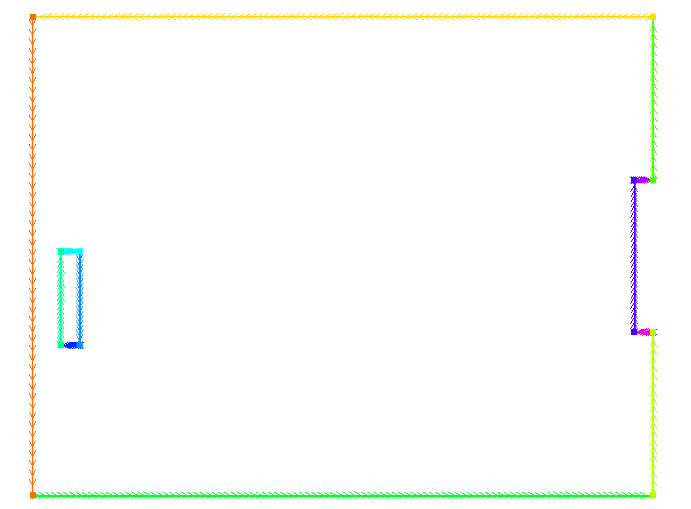


### Formulation de l'equation de chaleur
Le problème stationnaire est le suivant :

$$ k \Delta T = 0 $$

Notons $\Omega$ la pièce et $\Gamma$ les bords de la pièce. $\Gamma = \Gamma_1 + \Gamma_2 + \Gamma_3$ où $\Gamma_1$ est les murs de la pièce, $\Gamma_2$ désigne les bords du radiateur, et $\Gamma_3$ désigne les bords de la fenêtre.

D'où :

$$ \int_\Omega v k \Delta T = 0 $$

D'après la formulation de Green pour le champ de température T, qui est $C^1$:

$$ \int_\Omega v \Delta T = \int_\Omega \nabla v \cdot \nabla T dx + \int_\Gamma v(x) \partial_n T dx $$

On a l'équation finale suivante :

$$ \int_\Omega k \nabla v \cdot \nabla T dx + \int_\Gamma k v(x) \partial_n T dx = 0 $$

## Cas 1 : Flux de chaleur au mur

On considère les conditions suivantes au bord:
- Bord de la fenêtre : Température imposée T = -2°C
- Mur : Flux de chaleur imposée Φ = k∇T·n = −0.31W/m³
- Radiateur : Température imposée T = 50°C

On a donc l'équation :

$$ \int_\Omega k \nabla v \cdot \nabla T dx + \int_\Gamma v(x) \Phi dx = 0 $$

On intègre avec le solveur Conjugate Gradient de FreeFem :

```cpp
solve Laplace(u, v) = 
    int2d(Th)(    // The bilinear part
        dx(u)*dx(v) + dy(u)*dy(v)
    )
    + int1d(Th,c1,c2,a,b,d)( flux / kheat * v )
    //+ int1d(Th, c2)( 0.31 / kheat * v )
    + on(arad, u=tempradiator)
    + on(brad, u=tempradiator)
    + on(crad, u=tempradiator)
    + on(drad, u=tempradiator)
    + on(awind, u=tempwindow)
    + on(bwind, u=tempwindow)
    + on(dwind, u=tempwindow);
```

Resultats :

Avec un flux de chaleur nulle au niveau du mur ( $\Phi = 0 $), on obtient le champ stationnaire suivant 
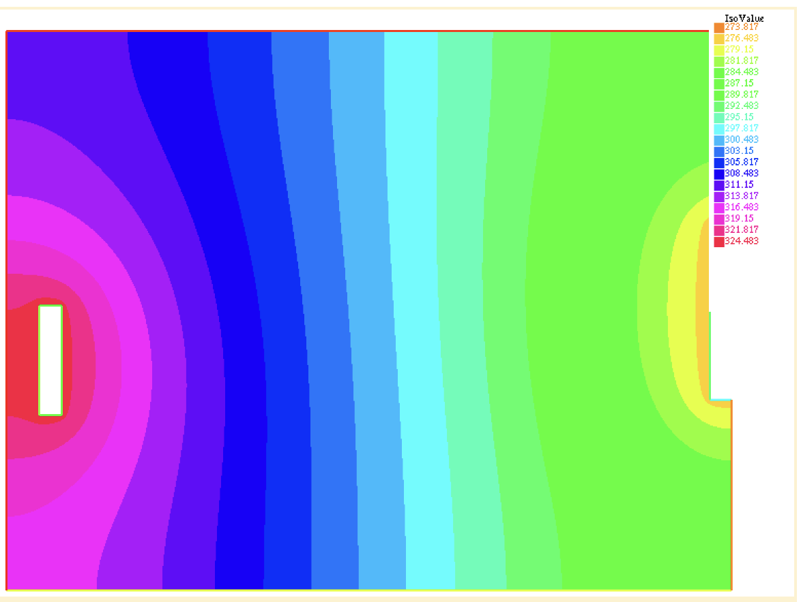

Avec un flux de chaleur non nulle au niveau du mur ( $\Phi = 0.31 W/mK $), on obtient le champ stationnaire suivant 
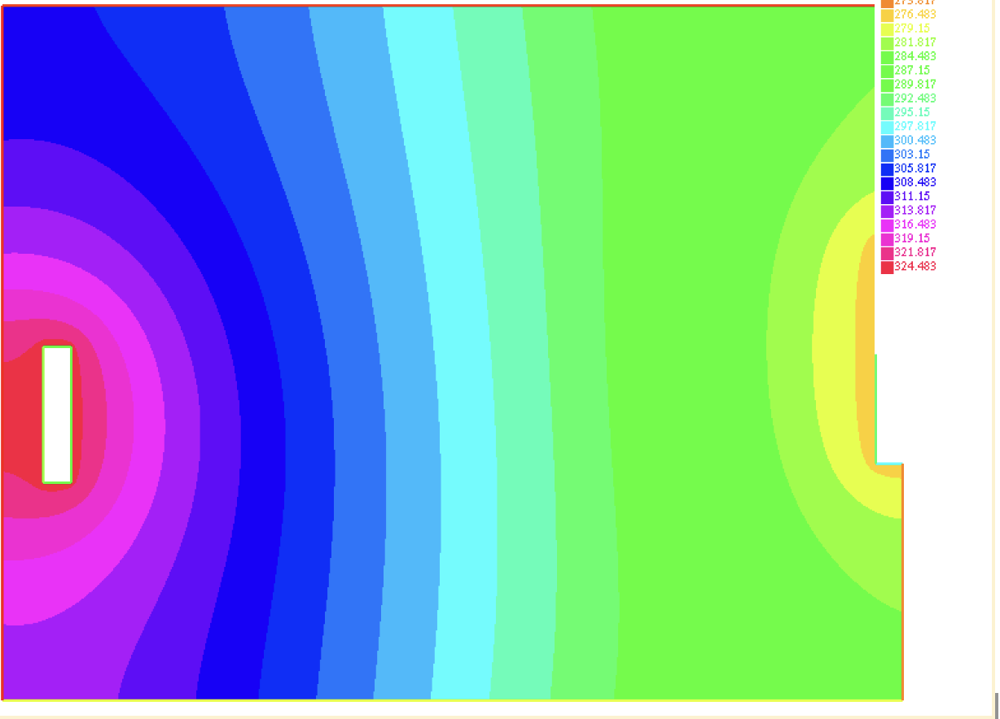


## Cas 2 : Condition de Fourier au niveau du radiateur

Les conditions aux bords sont alors :

- Bord de la fenêtre : Température imposée T = -2°C
- Mur : Température imposée T = -2°C
- Radiateur : Condition de Fourier k∇T·n + h(T - Tf) = 0, avec h = 1W/(m°C) et Tf = 50°C

L'équation devient :

$$ \int_\Omega k \nabla v \cdot \nabla T dx + \int_\Gamma v(x) \frac{h}{k} (T - T_f) dx = 0 $$

On introduit le terme bilinéaire dans le solveur :

```cpp
solve Laplace(u, v) = 
    int2d(Th)(    // The bilinear part
        dx(u)*dx(v) + dy(u)*dy(v)
    )
    + int1d(Th,arad,brad,crad,drad)( v * hfourier / kheat * u)
    - int1d(Th,arad,brad,crad,drad)( v * hfourier / kheat * tempradiator )
    + on(awind, u=tempwindow)
    + on(bwind, u=tempwindow)
    + on(dwind, u=tempwindow)
    + on(a, u=tempwindow)
    + on(b, u=tempwindow)
    + on(c1, u=tempwindow)
    + on(c2, u=tempwindow)
    + on(d, u=tempwindow);
```

Résultats :

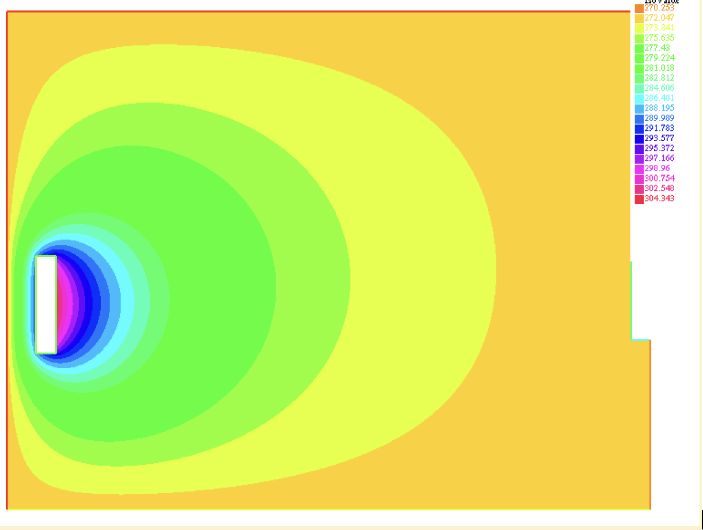

## Cas 3 : Condition de Fourier au niveau du mur

Les conditions aux bords sont alors :

- Bord de la fenêtre : Température imposée T = -2°C
- Mur : Condition de Fourier k∇T·n + h(T - Tf) = 0, avec h = 1W/(m°C) et Tf = -2°C
- Radiateur : Température imposée T = 50°C

Résultats :

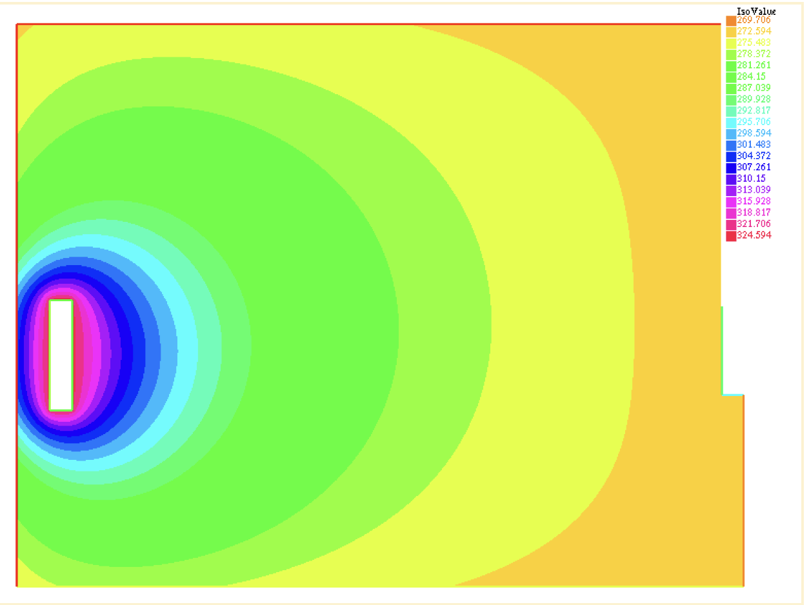


# Problème Transitoire

On etudie dorenavant le regime transitoire, lorsque le radiateur est allume. 
On considere que la piece est d'une temperature intiale uniforme a $T_0 = - 2 C$ 

## Formulation variationnelle du problème 

L'équation du régime transitoire est la suivante :

$$ \rho C_p \frac{\partial T}{\partial t} + k \Delta T = 0 $$

On choisit de résoudre cette équation avec la Méthode Euler Implicite, qui est plus rapide que la méthode Euler explicite.

On discrétise donc les opérateurs par rapport au temps :

$$ \frac{T_{n+1} - T_n}{\Delta t} \approx \frac{\partial T}{\partial t} $$
$$ \Delta T_{n+1} \approx \Delta T $$

On réécrit alors l'équation d'inconnue $T_{n+1} = T(t_{n+1})$ :

$$ \rho C_p \frac{T_{n+1} - T_n}{\Delta t} + k \Delta T_{n+1} = 0 $$

On passe a une formulation variationnelle du probleme:

$$ \int_\Omega \left(\rho C_p \frac{T_{n+1} - T_n}{\Delta t} + k \Delta T_{n+1}\right) v dx = 0 $$
$$ \int_{\Omega} \frac{\rho C_p}{\Delta t} T_{n+1} v dx + k \int_{\Omega} \nabla T_{n+1} \cdot \nabla v dx = \int_{\Omega} \frac{\rho C_p}{\Delta t} T_n v dx$$

On peut obtenir donc la valeur du champ $T_{n+1}$ a partir du champ $T_n$ a chaque instant. 

Nous choisissons un pas de discrétisation $\Delta t = 60$ s.
On observe une phase stationnaire au bout de 300 minutes environ, soit 5 heures.
Voici le champ de température sur 7 instants différents, du début à la fin de la phase stationnaire.

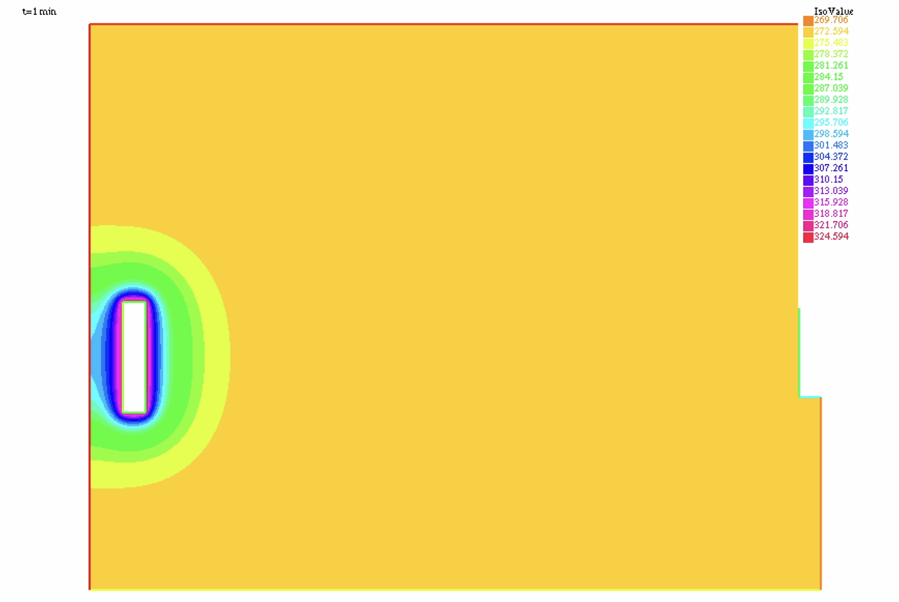

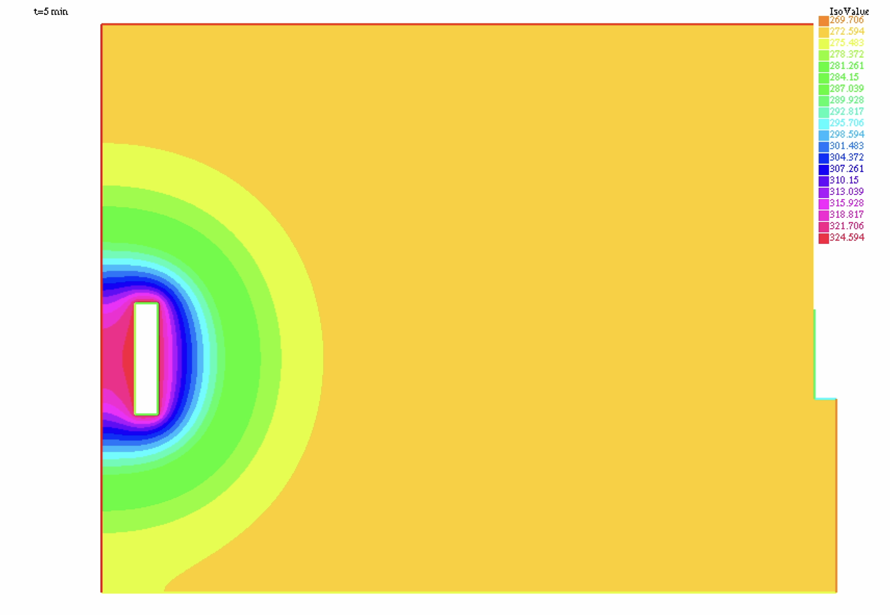
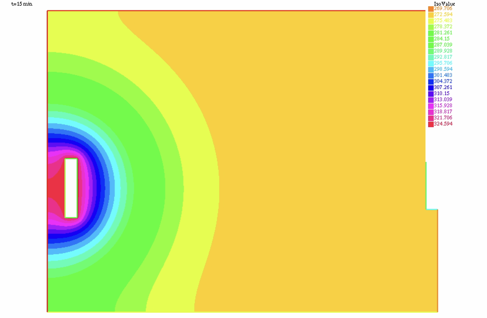
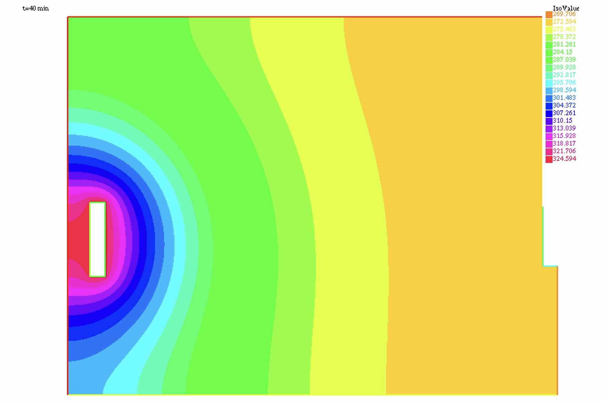
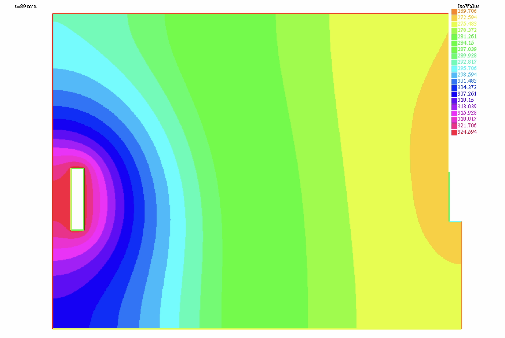
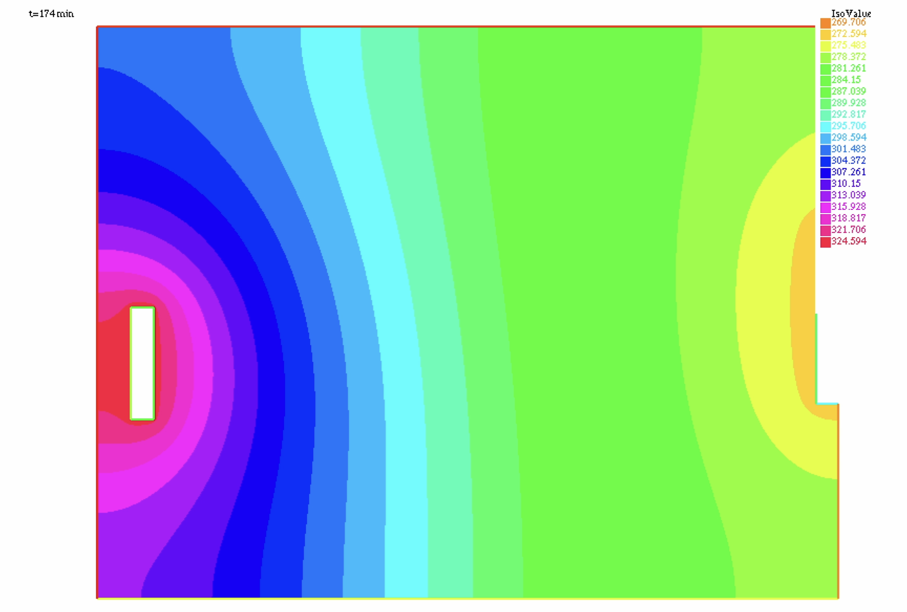
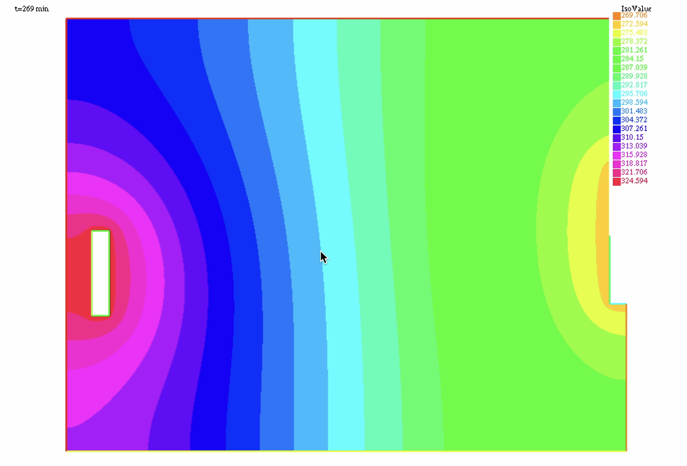
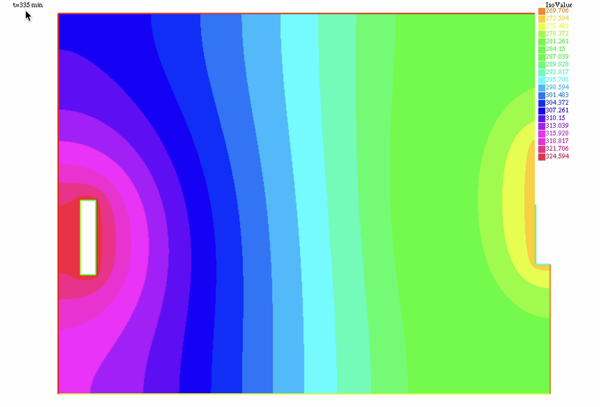